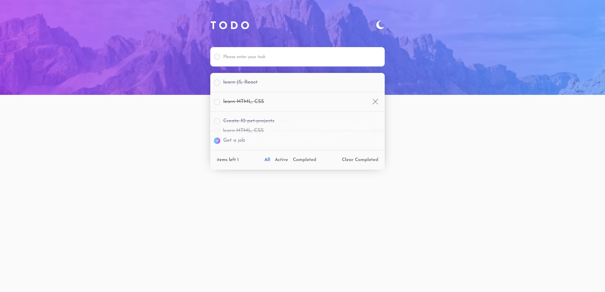
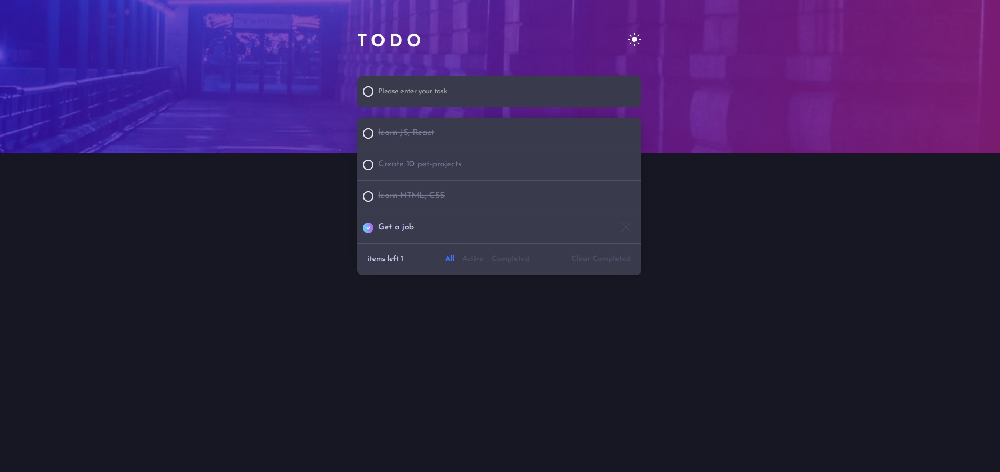
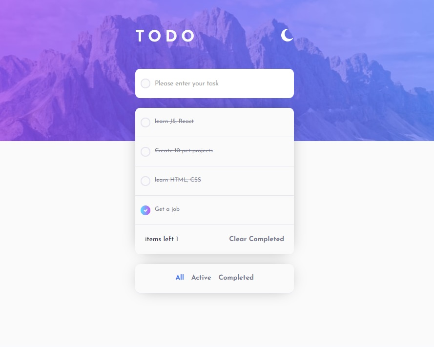

# Todo app solution

## Table of contents

- [Overview](#overview)
  - [The challenge](#the-challenge)
  - [Screenshot](#screenshot)
  - [Links](#links)
- [My process](#my-process)
  - [Built with](#built-with)
  - [What I learned](#what-i-learned)

## Overview

### The challenge

Users should be able to:

- View the optimal layout for the app depending on their device's screen size
- See hover states for all interactive elements on the page
- Add new todos to the list
- Mark todos as complete
- Delete todos from the list
- Filter by all/active/complete todos
- Clear all completed todos
- Toggle light and dark mode
- **Bonus**: Drag and drop to reorder items on the list

### Screenshot

### Links

- Solution URL: [Add solution URL here](https://github.com/VitaliySaburdo/todo-app)
- Live Site URL: [Add live site URL here](https://todo-app-seven-nu-29.vercel.app/)

## My process

### Built with

- Semantic HTML5 markup
- CSS custom properties
- Flexbox
- Mobile-first workflow
- [Zustand](https://zustand-demo.pmnd.rs/) - state manager
- [React](https://reactjs.org/) - JS library
- [SASS](https://sass-lang.com/) - For styles

### What I learned

In this project, I explored Zustand, a library for managing state in React applications. I repeated the basics of working with the SASS preprocessor. I also managed to implement drag-and-drop tasks in the tool list.
